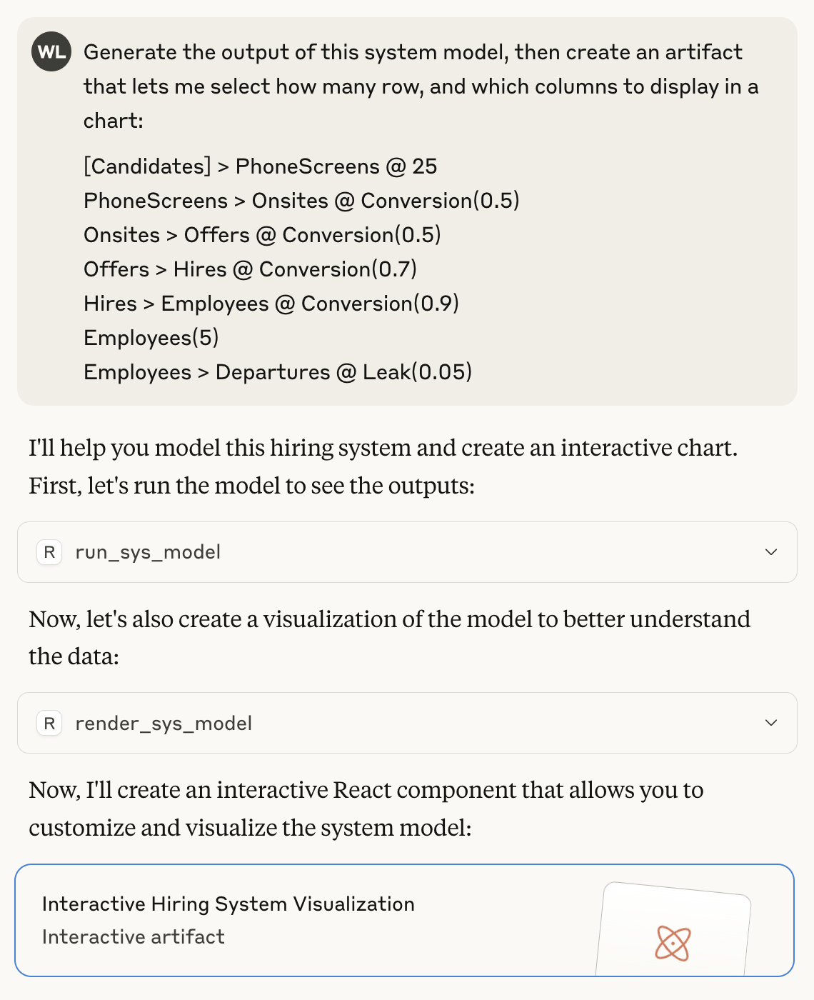
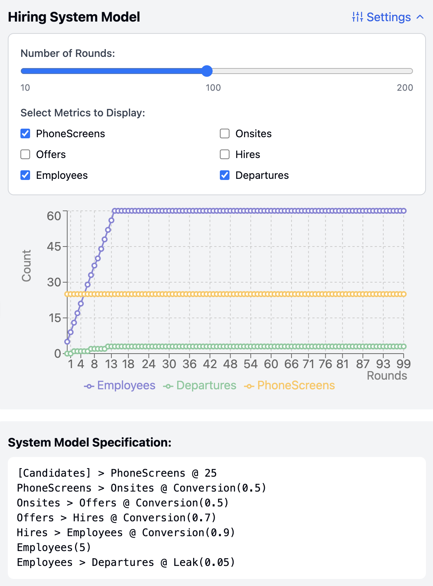
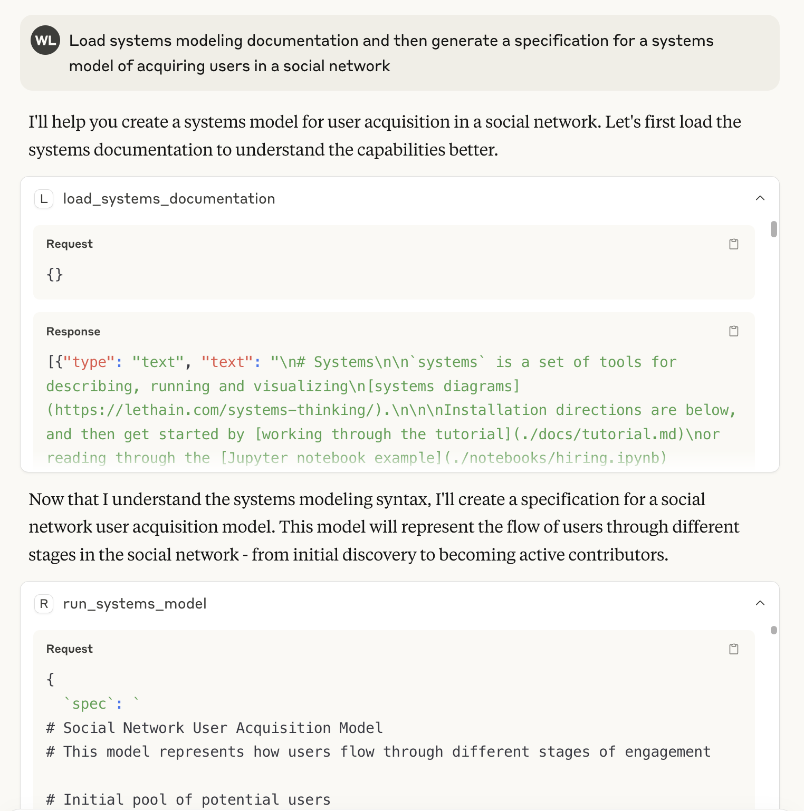
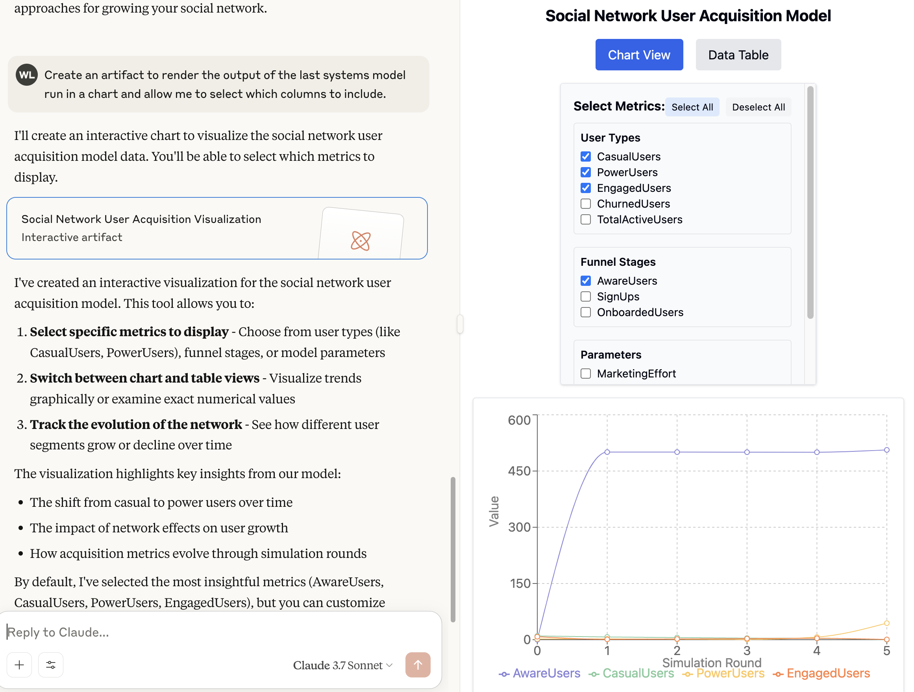

# systems-mcp

[systems-mcp](https://github.com/lethain/systems-mcp) is an MCP server for interacting with
the [`lethain:systems`](https://github.com/lethain/systems/) library for systems modeling.

It provides two tools:

* `run_systems_model` runs the `systems` specification of a systems model.
    Takes two parameters, the specification and, optionally, the number of
    rounds to run the model (defaulting to 100).
* `load_systems_documentation` loads documentation and examples into the context window.
    This is useful for priming models to be more helpful at writing systems models.

It is intended for running locally in conjunction with Claude Desktop or a similar tool.

## Usage

Here's an example of using `systems-mcp` to run and render a model.

Here is the artifact generated from that prompt, including the output from
running the systems model.

Finally, here is an example of using the `load_systems_documentation` tool to prime
the context window and using it to help generate a systems specification.
This is loosely equivalent to including [`lethain:systems/README.md`](https://raw.githubusercontent.com/lethain/systems/refs/heads/master/README.md) in the context window,
but also includes a handful of additional examples
(see the included files in [./docs/](./docs/).

Then you can render the model as before.

The most interesting piece here is that I've never personally used `systems` to model a social network,
but the LLM was able to do a remarkably decent job at generating a specification despite that.

## Installation

These instructions describe installation for [Claude Desktop](https://claude.ai/download) on OS X.
It should work similarly on other platforms.

1. Install [Claude Desktop](https://claude.ai/download).
2. Clone [systems-mcp](https://github.com/lethain/systems-mcp) into
    a convenient location, I'm assuming `/Users/will/systems-mcp`
3. Make sure you have `uv` installed, you can [follow these instructions](https://modelcontextprotocol.io/quickstart/server)
4. Go to Cladue Desktop, Setting, Developer, and have it create your MCP config file.
    Then you want to update your `claude_desktop_config.json`.
    (Note that you should replace `will` with your user, e.g. the output of `whoami`.

        cd /Users/will/Library/Application Support/Claude
        vi claude_desktop_config.json

    Then add this section:

        {
          "mcpServers": {
            "systems": {
              "command": "uv",
              "args": [
                "--directory",
                "/Users/will/systems-mcp",
                "run",
                "main.py"
              ]
            }
          }
        }

5. Close Claude and reopen it.
6. It should work...

